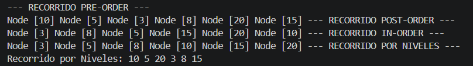
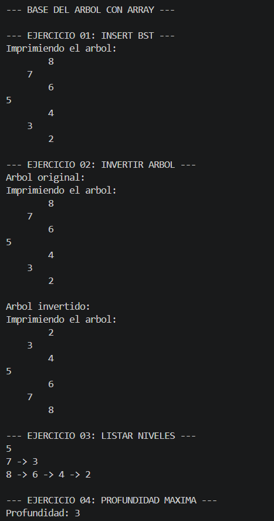

# Estructuras de Datos – Ejercicios con Arboles Binarios

## Practica: Arboles

## Estudiante: Josue Calle

## Grupo: 3

 Fecha: 17/06/2026

### 1. IntTree

Fecha: 16/06/2026

Descripcion: Se realizo un arbol con nodos enteros, ademas de los metodos preorder, posorder, inorder y calcular la altura.

### 2. BinariTree

Fecha: 17/06/26 

Se implementaron las clases `BinaryTree` y `Person`, permitiendo la creación de un árbol binario capaz de almacenar objetos de tipo `Person`. Además, la clase `BinaryTree` fue adaptada para trabajar con datos genéricos y se añadieron validaciones para realizar las comparaciones entre personas según su edad. En caso de que dos personas tengan la misma edad, el criterio de comparación secundario utilizado es el nombre.

Fecha: 23/06/26

Descripcion: El dia de hoy realizamos unos ejercicios y aparte de eso realizamos un informe.